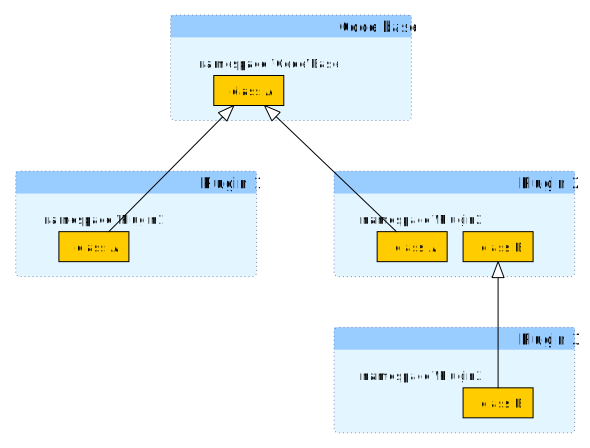
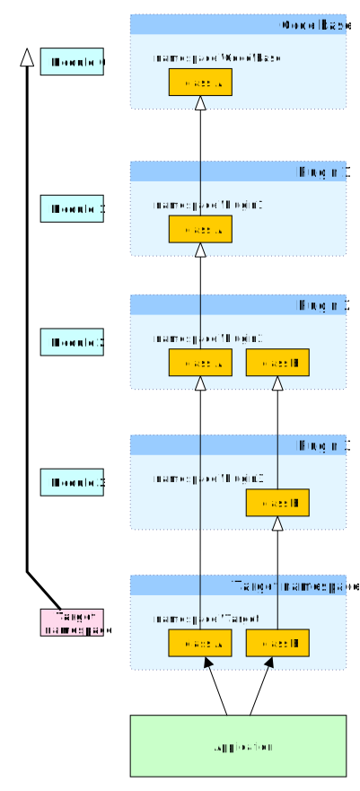

Together with 
[mapping-class-loader](https://github.com/exteon/mapping-class-loader),
this library provides a framework plugin development and loading. By using a
"chain-loading" concept, it provides an implementation platform sitting 
somewhere between mixins and multiple inheritance. 

## Abstract

A common problem concerning a platform that offers plugins functionality is 
this: we have a number of plugins that are developed against the same code-base
(the same contracts), however they are unaware of each other (they must act 
like black-boxes for other plugins).

By their nature, plugins are tight-coupled to the base code they extend or 
customize. At the same time, loaded plugins' effect needs to be additive. 
Multiple plugins coupled to the codebase must be aggregated to work together.

Some of the solutions commonly implemented we found coming short:
- decorators-based approach doesn't provide enough coupling, plugins 
  structure is an "onion layer" where output of an outer layer cannot be fed to
  the input of an inner layer
- observer pattern plugin systems (hooks, event-driven, generic invoker mixins 
  ect) are very costly to implement, maintain and debug
  
Most efficient plugin patterns rely on mixins, which are akin' to multiple 
inheritance. PHP's Traits, while a great feat, are not sufficient to
implement the mixin patterns needed for plugins, as they lack a static identity
(static properties are duplicated to their implementing classes).

Our solution provides a way of loading plugins in a chaining (layered) dynamic
structure (much like decorators), but uses source weaving to modify class 
hierarchy so that the resulting inheritanve model is fully-coupled.

The below illustrations will provide a more visual explanation of the chaining 
process. Let's start with how, starting from a codebase, plugin developers would
add specialisation by extending the existing classes, with the purpose that
their specialisations will replace the initial implementation:



So in the image above, both `Plugin1` and `Plugin2` extend the base code, while
`Plugin3` is based on `Plugin2`.

The question is, how do we rejoin these structure so that we can use all 3 
plugins in an app, with only one `A` class and one `B` class?

In comes `chaining-class-resolver`:



With `chaining-class-loader`, code comes in modules, and all base code and 
plugins are modules that will be linearized. That is done at class load time, by
changing the inheritance. In the second diagram, you will have noticed how
`\Plugin2\A` now inherits from `\Plugin1\A`, not from `\Code\Base\A` as was in 
the original source (first diagram).

All such linearized classes are then projected into a *Target namespace* so that
an application can use i.e. `\Target\A` with relative obliviousness to the chain
that generated it.

This class weaving is done at runtime, so the process is transparent to the 
application developer, that just needs to configure the modules. Thus, the 
plugins can be brought in from any source (such as, `composer`) and they won't
need to be customized in any way specific to the application, 
`chaining-class-resolver` will do all the magic.

## Usage

You can find the example in the diagrams above implemented in the 
[example](example) directory. 

The loader setup part is in [setup.inc.php](example/setup.inc.php)

To run the example, run [app.php](example/app.php)

The steps to set up chaining class loading are:

### Creating the modules

We organize the modules in folders with a PSR-4 class structures:

* [base](example/base) with namespace `Code\Base`
* [plugins/plugin1](example/plugins/plugin1) with namespace `Plugin1`
* [plugins/plugin2](example/plugins/plugin1) with namespace `Plugin2`
* [plugins/plugin3](example/plugins/plugin1) with namespace `Plugin3`

Each module defines or extends classes `A` and/or `B` like in the 
[above diagram](doc/plugin%20development.svg)

You are free to use any directory structure, as long as you have a number of 
module directories each containing a PSR-4 namespace. 

### The module registry

Next, we must register the modules with the `ModuleRegistry`:

```php
use Exteon\Loader\ChainingClassResolver\ModuleRegistry;
use Exteon\Loader\ChainingClassResolver\Module;
use Exteon\Loader\ChainingClassResolver\ClassFileResolver\PSR4ClassFileResolver;

ModuleRegistry::registerModule(
    new Module(
        'Code base',
        [new PSR4ClassFileResolver(__DIR__ . '/base', 'Code\\Base')]
    )
);
ModuleRegistry::registerModule(
    new Module(
        'Plugin 1',
        [new PSR4ClassFileResolver(__DIR__ . '/plugins/plugin1', 'Plugin1')]
    )
);
ModuleRegistry::registerModule(
    new Module(
        'Plugin 2',
        [new PSR4ClassFileResolver(__DIR__ . '/plugins/plugin2', 'Plugin2')]
    )
);
ModuleRegistry::registerModule(
    new Module(
        'Plugin 3',
        [new PSR4ClassFileResolver(__DIR__ . '/plugins/plugin3', 'Plugin3')]
    )
);
```

Modules will be chained in the order they are registered with the 
`ModuleRegistry`; there is no dynamic dependency resolution implemented; this 
means, in the above example, `Plugin 1` will extend/override classes in 
`Code base`, `Plugin 3` will override all, ect.

***Note***

In order to enable the caching functionality for the weaved class 
files, the `ModuleRegistry` is an abstract singleton and modules are identified 
globally by their name (the 1st parameter in the `Module` constructor), which 
must be unique.

Read [here](#caching) for more details about caching.

### The chaining resolver

We get a resolver instance:

```php
use Exteon\Loader\ChainingClassResolver\ChainingClassResolver;

$chainingClassResolver = new ChainingClassResolver(
    'Target'
);
```

The `$targetNs` constructor parameter defines the target namespace that the 
class chain will be weaved into, in our case the classes will be chained under
`\Target`.

### Setting up the loader

We will use 
[exteon/mapping-class-loader](https://github.com/exteon/mapping-class-loader)
to load the chained files:

```php
use Exteon\Loader\MappingClassLoader\MappingClassLoader;
use Exteon\Loader\MappingClassLoader\StreamWrapLoader;

$loader = new MappingClassLoader(
    [],
    [
        $chainingClassResolver
    ],
    [],
    new StreamWrapLoader([
        'enableMapping' => true
    ])
);
$loader->register();
```

For more details on using the `MappingClassLoader`, you can take a look at the
[exteon/mapping-class-loader documentation](https://github.com/exteon/mapping-class-loader)
.

### Using the chained classes

We can now use the chained classes. All classes define or override the 
`whoami()` method, adding the result.

```php
    use Target\A;
    use Target\B;

    $a = new A();
    $b = new B();

    var_dump($a->whoami());
    var_dump($b->whoami());
```

The above code will produce the following result:

```
array(3) {
  [0] =>
  string(11) "Code\Base\A"
  [1] =>
  string(9) "Plugin1\A"
  [2] =>
  string(9) "Plugin2\A"
}
array(2) {
  [0] =>
  string(9) "Plugin2\B"
  [1] =>
  string(9) "Plugin3\B"
}
```

So now the classes as chained as represented in 
[this diagram](doc/app%20development.svg).

### Class hint files

If you open [app.php](example/app.php) in your smart IDE, the classes in the 
`Target` namespace will be unresolved and you will not have any autocompletion 
for them. That is because `Target\A` and `Target\B` are not yet defined anywhere
in the code.

In order to fix this, we need to create class hint files that will contain the
stubs for the `Target` classes. We can do this by running 
[create-hints.php](example/create-hints.php) in the [example](example) 
directory.

Using the same [setup.inc.php](example/setup.inc.php), this tools runs

```php
$loader->dumpHintClasses(__DIR__.'/dev/hints');
```

What this does is generate class hint files in `dev/hints`. These are PHP class
files with PSR-4 structure that are generated in the directory you specify. Now
just add the hints directory to your source directories in your IDE and now,
your `Target\A` class will be defined as such:

```php
namespace Target {
    /**
     * @extends \Code\Base\A
     * @extends \Plugin1\A
     */
    class A extends \Plugin2\A {}
}
```

***Note*** 

The `dumpHintClasses` tool should be ran whenever you add classes or change the
classes hierarchy in your project, reconfigure your modules ect. to regenerate 
the hint files.

***Note***

The hint classes contain only one extend, i.e. `Plugin2\A`, which in your source
files extends `Code\Base\A`. Therefore, if you now add a `someMethod()` method
on `Plugin1\A`, this method will not be known on static analysis on `Target\A`,
there will be no autocomplete for it, unless your IDE can read the multiple 
`@extends` annotations.

In a future version, we might address this by always using traits for class 
extending. (See [Traits chaining](#traits-chaining))

However, the primary functionality of a plugin is to modify (i.e. override) 
existing class methods. Therefore, we advise that when you think about extending
an existing class's contract, you consider doing this using separate traits that 
you `use` or you use object composition to keep added functionality into 
separate classes. 

## Other features

### Debugging

Even though the `chaining-class-resolver` modifies (weaves) the source code to 
achieve its functionality, step debugging can be easily performed using 
`exteon/mapping-class-loader`'s mapping functionality. When debugging code, you
will be stepping on the original class files as usual. The only thing you need 
to do, as in the code examples above, is to set `'enableMapping' => true` to 
`StreamingWrapLoader`'s config.

To read more about the mapping functionality, please refer to the
[exteon/mapping-class-loader documentation](https://github.com/exteon/mapping-class-loader#debug-mapping) 
.

### <a id="caching"></a>Caching

The class weaving process can be a significant overhead; 
[exteon/mapping-class-loader](https://github.com/exteon/mapping-class-loader)
provides caching for the weaved class files. To enable caching, you need to set
the `enableCaching` and `cacheDir` config options to the `MappingClassLoader`
constructor. For more details about caching, see the 
[exteon/mapping-class-loader documentation](https://github.com/exteon/mapping-class-loader#caching)
.

For development, whenever you change the source classes, the cache needs to be 
cleared and reprimed; there is a work in progress for a change watcher over 
`inotify`, but until that is published, you should create your own tool, if you
use caching in a development setup.

### <a id="traits-chaining"></a>Traits chaining

In PHP, traits that implement the same method cannot be added on the same class
([see here](https://www.php.net/manual/en/language.oop5.traits.php#language.oop5.traits.conflict)).
While this is an artefact of the copy-paste trait implementation, it's also a
setback in traits reusability and expresiveness. Since `parent::` and `static::`
are supported for traits and PHP doesn't support overloading, it makes sense 
that multiple traits can override the same base method.

`chaining-class-resolver` supports this by linearizing (chaining) the list of 
traits in a class `uses` clause, creating intermediate classes, each using one 
trait. Therefore, traits precedence is the order in which they are listed in the 
`use` clause.

For instance, this is possible with `chaining-class-resolver` (note the 
different classes need to be implemented in different files as per PSR-4 
standard):

```php
class A {
    public function whoami(){
        return ['A'];
    }
}
```

```php
trait T1 {
    public function whoami(){
        return array_merge(parent::whoami(),['T1']);
    }
}
```

```php
trait T2 {
    public function whoami(){
        return array_merge(parent::whoami(),['T2']);
    }
}
```

```php
class B extends A {
    use T1,T2;
    public function whoami(){
        return array_merge(parent::whoami(),['B']);
    }
    
}
```

```php
var_dump((new B())->whoami());
```

This will list `['A','T1','T2','B']` as class inheritance.

Please also further see [Multiple Inheritance Considerations](#multiple-inheritance-considerations) for a more 
dogmatic discussion of the implications. 

### <a id="multiple-inheritance-considerations"></a>Multiple Inheritance Considerations

If chained classes, or multiple traits, all define a new method with the same 
name, the infamous 
[diamond problem](https://en.wikipedia.org/wiki/Multiple_inheritance#The_diamond_problem)
arises. `chaining-class-resolver` has no special handling for it, but then PHP
also doesn't (there is no syntax to explicitly signify an override). Therefore, 
having multiple traits defining the same new method is allowed, as long as, per 
PHP rules, the second method's signature is compatible with the first, making it 
an assumed override.

In the future we might implement a more stringent mechanism to detect and 
address the diamond problem.

### Chaining reflection

You can find information about the chained classes at runtime using 
`ChainedClassMeta`:

```php
ChainedClassMeta::get('Some\Class')->isChained()
```
Returns whether the named class is attached to a chain.

```php
ChainedClassMeta::get('Some\Class')->getChainParent()
```
Returns `Some\Class`'s chain parent class as a `ChainedClassMeta` object or null
if there is none. use `->getClassName()` to get this parent's class name.

```php
ChainedClassMeta::get('Some\Class')->getChainedClass()
```
Returns the `Some\Class`'s chain target class (i.e. the end of the chain in the 
target namespace).

```php
ChainedClassMeta::get('Some\Class')->getModuleName()
```
Returns the name of the module that defines `Some\Class`.

```php
ChainedClassMeta::get('Some\Class')->getChainTraits()
```
Returns the traits that were added in `Some\Class`'s chain by all chained 
classes. (But not the inherited ones).

```php
ChainedClassMeta::get('Some\Class')->getChainInterfaces()
```
Returns the interfaces that were added in `Some\Class`'s chain by all chained 
classes. (But not the inherited ones).
